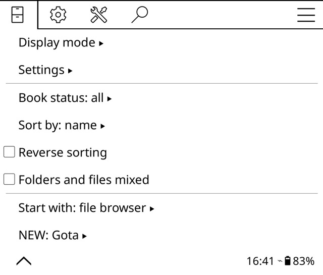

# 📚 Gota Plugin for KOReader

A KOReader plugin to access and read your [Raindrop.io](https://raindrop.io) bookmarks directly on your e-reader.

<p align="center">
  
  
  
</p>

## ✨ Features

- 📖 **Browse Collections**: Navigate your Raindrop collections with full pagination
- 🔍 **Simple Search**: Quick text-based article search
- 🎯 **Advanced Search**: Filter by tags and content types (article/image/document)
- 📄 **Read Articles**: View content as plain text or open in full HTML reader
- 💾 **Save Offline**: Download HTML articles for offline reading
- 🌍 **Internationalization**: Automatic language detection (English/Spanish supported)
- ⚙️ **Configurable**: Customizable download folder with visual folder picker
- 📱 **Multi-Device**: Works on any device that supports KOReader

## 📦 Installation

### Method 1: Manual Installation

1. Download the latest release or clone this repository
2. Copy the `gota.koplugin` folder to your KOReader plugins directory
3. Restart KOReader

### Method 2: From Source

```bash
git clone https://github.com/cristenger/gota.koplugin-for-raindrop.git
cd gota.koplugin-for-raindrop
cp -r gota.koplugin /path/to/koreader/plugins/
```

## 🚀 Quick Start

### 1. Get Your Raindrop.io Test Token

The plugin uses Raindrop.io **Test Tokens**, which are perfect for personal use on e-readers:

1. Go to [Raindrop.io App Management Console](https://app.raindrop.io/settings/integrations)
2. Click **"Create new app"** (or open an existing app)
3. Give it a name (e.g., "KOReader")
4. Once created, you'll see a **"Test token"** in your app settings
5. Click to copy the test token (looks like: `abc123def456...`)

✅ **Why Test Tokens?**
- ✨ **No setup required** - Just copy and paste
- ⏰ **Never expires** - Set it once, use it forever
- 🔒 **Secure** - Full access to your personal Raindrop account
- 📱 **Perfect for e-readers** - No web browser needed

⚠️ **Note**: OAuth tokens are not supported because they require a web browser for authorization, which most e-readers don't have.

### 2. Configure the Plugin

1. Open KOReader
2. Go to: **☰ Menu → Gota → Configuration**
   - *Note: On first use, the menu will show "NEW: Gota" until you open it once*
   - *On some Kindle devices, look for "Gota" in the main menu list*
3. Select **Configure access token**
4. Paste your token
5. Tap **Save** (or **Test** to verify first)
6. The token will be automatically loaded when you restart KOReader

### 3. Find Gota in the Menu

Gota appears in the **main menu** of KOReader:

📍 **Location**: Tap the ☰ (menu icon) → Look for **"Gota"** in the list
<p align="center">
  
</p>

### 4. Start Reading!

Once configured, you can:

- **All articles**: Browse all your bookmarks
- **View collections**: Navigate your organized collections
- **Search articles**: Quick text search
- **Advanced search**: Filter by tags and content type

## 📖 Usage Guide


### Browse Your Collections

```
Menu → Gota → View collections
```

- Shows all your Raindrop collections with article counts
- Tap any collection to see its articles
- Navigate with pagination (25 articles per page)

### Search Articles

**Simple Search:**
```
Menu → Gota → Search articles
```
- Enter any search term
- Results show matching articles across all collections

**Advanced Search:**
```
Menu → Gota → Advanced search
```
- Filter by **tags** (e.g., `#programming`, `#design`)
- Filter by **type** (article, image, document)
- Combine filters with text search
- Shows available tags with article counts

### Read an Article

When viewing article results, tap any article to see options:

1. **Open in full reader**: Opens HTML with formatting
2. **View content as plain text**: Simple text view
3. **View article information**: See metadata (tags, URL, cache status)
4. **Copy URL**: Copy article link to clipboard

### Configure Download Folder

```
Menu → Gota → Configuration → Configure download folder
```

**Option 1: Browse folders (Recommended)**
- Visual folder picker
- Navigate your file system
- Select existing folder with one tap

**Option 2: Enter folder name manually**
- For advanced users
- Type folder name (e.g., `my_articles`)
- Folder created automatically in KOReader data directory

## 🌍 Language Support

The plugin automatically detects your KOReader language setting:

- **English** (default)
- **Español** (Spanish)

To change language:
```
KOReader Settings → Language → Select your language → Restart KOReader
```

### Contributing Translations

Want to add your language?

1. Copy `l10n/templates/gota.pot` to `l10n/<language_code>/gota.po`
2. Translate the strings in the `.po` file
3. Compile: `./compile_translations.sh <language_code>`
4. Submit a pull request!

See [l10n/README.md](l10n/README.md) for detailed translation guide.

## ⚙️ Configuration

### Access Token
- **Where**: Configuration → Configure access token
- **Required**: Yes
- **Tip**: Use "Test" button to verify before saving

### Download Folder
- **Where**: Configuration → Configure download folder
- **Default**: `gota_articles/`
- **Tip**: Use folder picker for easy selection

### Debug Connection
- **Where**: Configuration → Debug Raindrop API connection
- **Shows**: Token status, API URL, saved settings
- **Use**: Troubleshoot connection issues

### Articles not showing

1. Check you have articles in Raindrop.io
2. Verify token 
3. Try "All articles" to see everything

### SSL Certificate Issues

⚠️ **Important**: SSL verification is disabled by default to prevent certificate errors on e-ink devices.

This is necessary because many e-readers have outdated certificate stores and cannot verify modern SSL certificates. The plugin disables SSL verification to ensure reliable connections to Raindrop.io API.

**Security note**: While this reduces security slightly, it's a necessary compromise for e-reader compatibility. Your access token is still transmitted over HTTPS encryption.

## 🏗️ Architecture

```
gota.koplugin/
├── main.lua                  # Plugin coordinator
├── api.lua                   # Raindrop.io API client
├── settings.lua              # Configuration management
├── dialogs.lua               # UI dialogs
├── ui_builder.lua            # Menu construction
├── content_processor.lua     # HTML processing
├── article_manager.lua       # Article operations
├── gota_reader.lua           # Reader integration
├── l10n/                     # Translations
│   ├── templates/gota.pot    # Translation template
│   └── es/gota.po           # Spanish translation
└── _meta.lua                 # Plugin metadata
```

### Development Setup

```bash
# Clone repository
git clone https://github.com/cristenger/gota.koplugin-for-raindrop.git
cd gota.koplugin-for-raindrop/gota.koplugin

# Check syntax
luac -p *.lua

# Update translations
python3 extract_strings.py
./compile_translations.sh

# Test in KOReader
cp -r ../gota.koplugin /path/to/koreader/plugins/
```


## 📄 License

MIT License - see [LICENSE](LICENSE) file for details

## 🙏 Acknowledgments

- [KOReader](https://github.com/koreader/koreader) - The amazing e-reader software
- [Raindrop.io](https://raindrop.io) - Excellent bookmark management service
- All contributors and testers

---

<p align="center">
  Made with ❤️ for KOReader users
</p>

<p align="center">
  <a href="https://raindrop.io">
    
  </a>
  <a href="https://koreader.rocks">
    
  </a>
</p>
