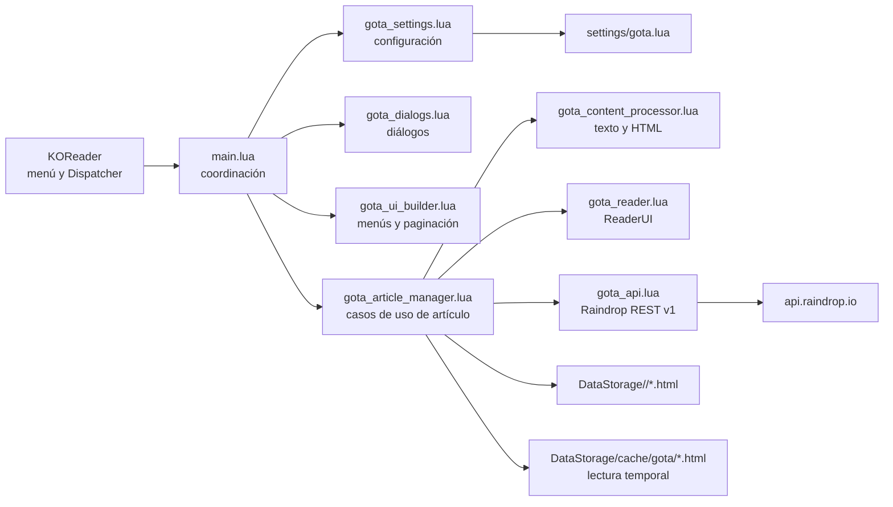
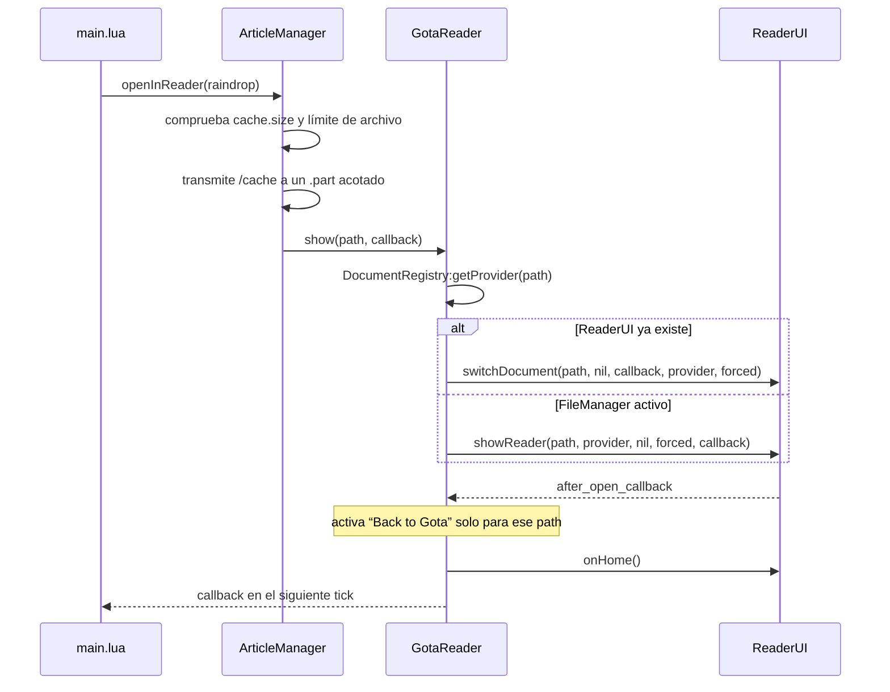

# Arquitectura de Gota

Este documento describe la arquitectura vigente de Gota 2.3.0. La versión de referencia es KOReader 2026.07 o posterior. El código se contrastó con KOReader 2026.07/master y con la API REST v1 de Raindrop.io el 15 de agosto de 2026.

## Alcance

Gota es un plugin de KOReader para una cuenta personal de Raindrop.io. Permite navegar grupos y colecciones, buscar por alcance, revisar resaltados globales, consultar metadatos, editar campos reversibles y abrir o exportar la copia permanente de un artículo.

La autenticación implementada es mediante un token pegado por el usuario. No existe flujo OAuth ni renovación de tokens. La copia permanente de artículos requiere Raindrop PRO; las notas y los resaltados no.

## Componentes



| Módulo | Responsabilidad | No debe hacer |
|---|---|---|
| `main.lua` | Componer dependencias, registrar menú/Dispatcher y coordinar pantallas | Interpretar HTTP o transformar HTML |
| `gota_api.lua` | Transporte HTTPS, autenticación, redirects, reintentos, caché de respuestas y endpoints | Construir widgets |
| `gota_article_manager.lua` | Cargar, recargar, exportar y abrir artículos | Conocer internals de `ReaderUI` |
| `gota_content_processor.lua` | Sanear UTF-8, convertir HTML a texto y generar documentos locales | Hacer red |
| `gota_reader.lua` | Abrir/cambiar documento y volver a Gota mediante APIs públicas de KOReader | Preabrir documentos o modificar tablas internas del menú |
| `gota_ui_builder.lua` | Crear items, jerarquías de colecciones y paginación | Hacer red o persistir configuración |
| `gota_dialogs.lua` | Construir diálogos y recoger entradas | Guardar directamente ajustes |
| `gota_settings.lua` | Leer y escribir `gota.lua` mediante `LuaSettings` | Registrar UI |
| `gota_version.lua` | Versión, User-Agent y objetivo KOReader | Contener lógica de ejecución |

## Ciclo de vida en KOReader

`Gota:init()` registra primero las acciones de Dispatcher, instancia las dependencias, declara su archivo de ajustes y se registra en el menú principal. `is_doc_only = false` permite que el mismo plugin esté disponible en FileManager y ReaderUI.

Las tres acciones de Dispatcher son:

- `gota_show_articles` → `GotaShowArticles`;
- `gota_search` → `GotaSearch`;
- `gota_collections` → `GotaShowCollections`.

El menú usa `registerToMainMenu`/`addToMainMenu` y `sorting_hint = "more_tools"`. Gota no escribe en `reader.menu.menu_table`.

### Apertura y retorno del lector



`DocumentRegistry:getProvider` solo selecciona el proveedor. `ReaderUI` conserva la propiedad exclusiva de abrir y cerrar el documento; Gota no llama `DocumentRegistry:openDocument` por anticipado.

## Transporte y contrato Raindrop

La URL base es `https://api.raindrop.io/rest/v1`. El constructor rechaza HTTP, credenciales embebidas, query o fragmento en la URL base. Raindrop no ofrece un endpoint HTTP, por lo que HTTPS sigue siendo obligatorio como transporte.

En Kindle, la autenticación del certificado remoto no está implementada en el flujo soportado. Gota no modifica el estado global `ssl.https.cert_verify` ni fuerza `verify = "peer"`; hereda el comportamiento de LuaSec 1.3.2 incluido por KOReader, cuyo cliente HTTPS usa `verify = "none"` por defecto. El tráfico se cifra, pero el servidor no queda autenticado: un atacante activo en la red podría interceptar el Bearer token. El dispositivo debe usarse en una red de confianza. Esta es una limitación aceptada por compatibilidad, no una garantía de seguridad TLS.

Cada llamada inicial incluye `Authorization: Bearer <token>`. Se solicita `Accept-Encoding: identity` para no depender de binarios externos de gzip.

### Copia permanente y redirect

`GET /raindrop/{id}/cache` puede responder 307. Gota desactiva el seguimiento automático y aplica este flujo:

1. acepta redirects solo durante la descarga de caché;
2. exige una URL absoluta HTTPS sin credenciales;
3. limita la cadena a tres redirects;
4. no reenvía `Authorization` al host de almacenamiento;
5. acepta el HTML únicamente tras una respuesta 2xx final.

### Errores y reintentos

`JSON.decode` está protegido con `pcall`. Los bodies JSON de error aportan `errorMessage`, `message` o `error.message` cuando existen. Los timeouts de `socketutil` se restauran incluso si LuaSec lanza una excepción.

Solo las lecturas `GET`/`HEAD` reintentan errores de transporte, 429 y 5xx, hasta tres intentos. `POST`, `PUT`, `PATCH` y `DELETE` hacen exactamente un intento. El retraso es exponencial y, para 429, calcula `Retry-After` o las variantes documentadas de la cabecera de reset. Como este bucle corre en el hilo de UI, Gota solo duerme hasta tres segundos; si el servidor pide una espera mayor, devuelve el control y solicita reintentar más tarde. Los demás 4xx no se reintentan sin modificar la petición.

La caché de respuestas GET vive en memoria durante cinco minutos. `getRaindrop(id, true)` significa recarga forzada: invalida y omite la entrada almacenada.

### Endpoints usados

| Caso de uso | Endpoint |
|---|---|
| Usuario autenticado | `GET /user` |
| Estadísticas del usuario | `GET /user/stats` |
| Colecciones raíz | `GET /collections` |
| Colecciones hijas | `GET /collections/childrens` |
| Marcadores | `GET /raindrops/{collectionId}` |
| Marcador completo | `GET /raindrop/{id}` |
| HTML permanente | `GET /raindrop/{id}/cache` |
| Filtros | `GET /filters/{collectionId}` |
| Resaltados globales/por colección | `GET /highlights[/{collectionId}]` |
| Favorito, nota, tags y colección | `PUT /raindrop/{id}` |
| Mover a Trash, solo fuera de Trash | `DELETE /raindrop/{id}` |
| Todos los tags | `GET /tags` |
| Tags de una colección | `GET /tags/{collectionId}` |

La búsqueda avanzada construye un único parámetro `search`. Por ejemplo, texto `swift`, tag `coffee beans` y tipo `article` producen `swift #"coffee beans" type:article` antes del URL encoding. La búsqueda textual usa `sort=score`; una consulta que solo contiene filtros usa `-created`. El alcance puede ser global, una colección o una colección con `nested=true`. `/filters/{id}?tagsSort=-count` es la única fuente de los filtros populares.

## Modelo de caché de artículo

Raindrop separa los metadatos de caché del HTML. Gota refleja esa separación:

| Estado local | Significado | Acciones de lectura |
|---|---|---|
| `metadata_available` | `cache.status == "ready"` | habilita acciones que descargan bajo demanda |
| `html_loaded` | existe `cache.text` no vacío y acotado | permite transformar a texto o HTML enriquecido |
| `download_error` | falló, excedió el límite o llegó vacío | exige recarga/acción explícita |

Abrir el menú o recargar obtiene solo metadatos. La vista de texto descarga en memoria con un preset de 2–16 MiB (4 MiB por defecto). El lector y la exportación sin transformación transmiten directamente a archivo con un preset de 16–128 MiB (32 MiB por defecto). `cache.size` permite rechazo anticipado y el sink LTN12 aborta si el body real cruza el límite. Cada archivo usa `.part` y solo se renombra tras el 2xx final. El botón para exportar notas/resaltados no depende del HTML PRO.

## Colecciones

`API:getCollectionStructure()` conserva por separado `user.groups`, raíces e hijas. El builder ordena grupos por `sort` ascendente, respeta el orden exacto de raíces de cada grupo y ordena hermanos hijos por `sort` descendente. Los nodos no agrupados, huérfanos o involucrados en ciclos se conservan en “Other collections”. El colapso de grupo es local a la sesión. Si usuario o hijos fallan, las raíces siguen disponibles. `/user/stats` añade recuentos de All, Unsorted y Trash e información no accionable de enlaces rotos/duplicados.

Los IDs de sistema usados por la UI son `0` para todos los marcadores, `-1` para Unsorted y `-99` para Trash.

## Persistencia y seguridad

| Dato | Ubicación | Duración |
|---|---|---|
| Token, carpeta, orden y límites de caché | `DataStorage:getSettingsDir()/gota.lua` | persistente |
| HTML exportado | `DataStorage:getDataDir()/<download_path>/` | persistente |
| HTML usado por ReaderUI | `DataStorage:getDataDir()/cache/gota/` | temporal; al volver mediante Gota se borra junto con su entrada de historial |
| Respuestas API | tabla de `API.response_cache` | proceso, TTL 5 min |
| Estado de retorno del lector | singleton `GotaReader` | proceso y documento actual |

El diálogo muestra el token como contraseña, pero `LuaSettings` lo guarda en texto claro. El archivo debe tratarse como una credencial y no compartirse en informes, respaldos públicos o issues. El alcance soportado es una integración personal mediante test token; OAuth multiusuario queda fuera del diseño actual.

## Pruebas y validación

La suite autocontenida no necesita KOReader ni una cuenta real:

```bash
lua tests/run.lua
luac -p *.lua tests/run.lua
git diff --check
```

Cubre 51 casos: UTF-8/HTML adversarial, búsqueda por alcance, paginación abierta, URLs HTTPS, redirects sin fuga del Bearer, streaming y límites, envelopes/JSON, reintentos solo de lectura, grupos y orden de colecciones, resaltados, mutaciones allowlisted, protección de Trash, estadísticas, rutas, firmas de `ReaderUI` y Dispatcher.

Antes de publicar una release se requiere además un smoke test en KOReader 2026.07.1 o posterior y una prueba real contra Raindrop para 200/307/401/429. Esas pruebas verifican la integración real de LuaSec en Kindle, el renderizado e-ink y el servicio externo; no pueden sustituirse por mocks.

## Deuda conocida

- Las llamadas HTTP siguen siendo síncronas dentro del callback de `NetworkMgr`; una red lenta puede bloquear la UI durante el timeout. `NetworkMgr:runWhenOnline` comprueba conectividad, no crea un hilo.
- El proyecto soporta test tokens personales, no OAuth con refresh.
- La descarga cruda a CREngine necesita smoke test en Kindle/Kobo reales; si un port no abre el HTML, se mantendrá el límite y se diseñará una transformación acotada a archivo.
- Raindrop no documenta `count` en el ejemplo de listas; Gota acepta su ausencia y pagina de forma abierta.
- `main.lua` y `gota_content_processor.lua` siguen concentrando demasiada lógica; separar controladores de pantalla y plantillas HTML reducirá el coste de cambio.
- CI valida Lua 5.1, la suite local y el catálogo; aún no cubre una instancia real de KOReader ni una cuenta Raindrop.
- El catálogo español pasa validación gettext, pero varias traducciones heredadas siguen iguales al texto inglés y requieren revisión lingüística.

## Fuentes canónicas

KOReader:

- [plugin Hello 2026.07](https://raw.githubusercontent.com/koreader/koreader/v2026.07/plugins/hello.koplugin/main.lua)
- [Dispatcher](https://koreader.rocks/doc/modules/dispatcher.html)
- [ReaderUI 2026.07](https://raw.githubusercontent.com/koreader/koreader/v2026.07/frontend/apps/reader/readerui.lua)
- [DocumentRegistry 2026.07](https://raw.githubusercontent.com/koreader/koreader/v2026.07/frontend/document/documentregistry.lua)
- [PluginLoader 2026.07](https://raw.githubusercontent.com/koreader/koreader/v2026.07/frontend/pluginloader.lua)
- [Network manager 2026.07](https://raw.githubusercontent.com/koreader/koreader/v2026.07/frontend/ui/network/manager.lua)
- [InputDialog 2026.07](https://raw.githubusercontent.com/koreader/koreader/v2026.07/frontend/ui/widget/inputdialog.lua)
- [Menu 2026.07](https://raw.githubusercontent.com/koreader/koreader/v2026.07/frontend/ui/widget/menu.lua)
- [PathChooser 2026.07](https://raw.githubusercontent.com/koreader/koreader/v2026.07/frontend/ui/widget/pathchooser.lua)
- [ReadHistory 2026.07](https://raw.githubusercontent.com/koreader/koreader/v2026.07/frontend/readhistory.lua)
- [util 2026.07](https://raw.githubusercontent.com/koreader/koreader/v2026.07/frontend/util.lua)
- [pruebas de KOReader](https://koreader.rocks/doc/topics/Unit_tests.md.html)
- [releases de KOReader](https://github.com/koreader/koreader/releases)
- [LuaSec 1.3.2 usado por KOReader](https://raw.githubusercontent.com/brunoos/luasec/v1.3.2/src/https.lua)
- [bundle CA incluido en KOReader](https://raw.githubusercontent.com/koreader/koreader-base/master/thirdparty/certifi/CMakeLists.txt)

Raindrop.io:

- [autenticación](https://developer.raindrop.io/v1/authentication/calls.md)
- [tokens](https://developer.raindrop.io/v1/authentication/token.md)
- [listar y buscar raindrops](https://developer.raindrop.io/v1/raindrops/multiple.md)
- [raindrop y caché permanente](https://developer.raindrop.io/v1/raindrops/single.md)
- [colecciones](https://developer.raindrop.io/v1/collections/methods.md)
- [estructura anidada](https://developer.raindrop.io/v1/collections/nested-structure.md)
- [tags](https://developer.raindrop.io/v1/tags.md)
- [filtros agregados](https://developer.raindrop.io/v1/filters.md)
- [resaltados](https://developer.raindrop.io/v1/highlights.md)
- [modelo de raindrop](https://developer.raindrop.io/v1/raindrops.md)
- [operadores de búsqueda](https://help.raindrop.io/filters#need-more-precise-filtering)
- [errores y rate limits](https://developer.raindrop.io/readme.md)
